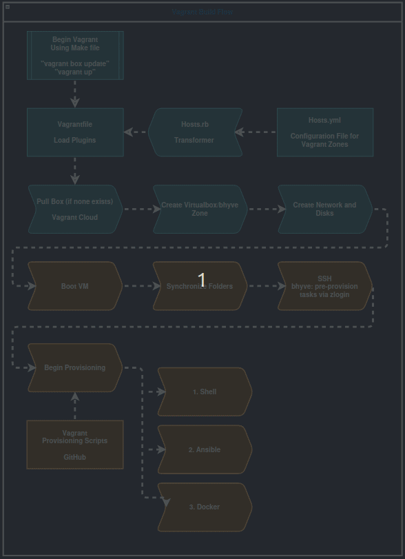

<!-- PROJECT LOGO -->
<br />
<p align="center">
  <a href="https://github.com/MarkProminic/simple-tasks-provisioner/">
    
  </a>

  <h3 align="center">Simple Vagrant Build Provisioner</h3>

  <p align="center">
    An README to jumpstart your provisioner scripts
    <br />
    <a href="https://github.com/MarkProminic/simple-tasks-provisioner/"><strong>Explore the docs »</strong></a>
    <br />
    <br />
    <a href="https://github.com/MarkProminic/simple-tasks-provisioner/">View Demo</a>
    ·
    <a href="https://github.com/MarkProminic/simple-tasks-provisioner/issues">Report Bug</a>
    ·
    <a href="https://github.com/MarkProminic/simple-tasks-provisioner/issues">Request Feature</a>
  </p>
</p>

<!-- TABLE OF CONTENTS -->
## Table of Contents

* [About the Project](#simple-task-provisioner)
  * [Built With](#built-with)
* [Getting Started](#getting-started)
* [Access Methods](#accessing-the-server)
* [Common Issues](#common-problems)
* [Roadmap](#roadmap)
* [Contributing](#contributing)
* [License](#license)
* [Contact](#authors)
* [Acknowledgements](#acknowledgments)

## Simple Task Provisioner

Primary goal is to use Vagrant and various provisioners to configure a Virtualbox or Bhyve VM.

* **Template:** [Packer](https://app.vagrantup.com/STARTcloud/boxes/debian12-server)
* **Build Source:** [Repo](Notyetavailableforpublicconsumption)

Each Release will be a at the time, stable branch. Recommended to use the latest.

## Getting Started

These instructions will get you a copy of the project up and running on your local machine for development and testing purposes, as well as what will power the build process of the VMs at Prominic.NET.

### Prerequisites

You will need some software on your PC or Mac:

```
git
Vagrant
Virtualbox
```

See more in the Wiki: [Dependency Installation](https://github.com/MarkProminic/simple-tasks-provisioner/wiki/Dependency-Installation)

## Clone, Config and Deploy

See more in the Wiki: [Clone, Config and Deploy](https://github.com/MarkProminic/simple-tasks-provisioner/wiki/Clone-and-Deploy)

## Starting the VM

The installation process is estimated to take about 15 - 30 Minutes.

```
vagrant up
```

Once the system has been provisioned, you can use 'vagrant ssh' to access
it, or again the utility scripts vagrant_ssh.sh/vagrant_ssh.ps1 to create
a log file of the ssh session.


## The Process


## Common Problems

### Error for Headless VirtualBox

If you get an error indicating that VirtualBox could not start in headless mode, open Vagrantfile and uncomment this line

```
     #vb.gui = true
```

## Roadmap

See the [open issues](https://github.com/MarkProminic/simple-tasks-provisioner/issues) for a list of proposed features (and known issues).

## Built With
* [Vagrant](https://www.vagrantup.com/) - Portable Development Environment Suite.
* [VirtualBox](https://www.virtualbox.org/wiki/Downloads) - Hypervisor.
* [Ansible](https://www.ansible.com/) - Virtual Manchine Automation Management.

## Contributing

Please read [CONTRIBUTING.md](https://www.prominic.net) for details on our code of conduct, and the process for submitting pull requests to us.

## Authors
* **Joel Anderson** - *Initial work* - [JoelProminic](https://github.com/JoelProminic)
* **Justin Hill** - *Initial work* - [JustinProminic](https://github.com/JustinProminic)
* **Mark Gilbert** - *Refactor* - [MarkProminic](https://github.com/MarkProminic)

See also the list of [contributors](https://github.com/MarkProminic/simple-tasks-provisioner/graphs/contributors) who participated in this project.

## License

This project is licensed under the SSLP v3 License - see the [LICENSE.md](LICENSE.md) file for details

## Acknowledgments

* Hat tip to anyone whose code was used
